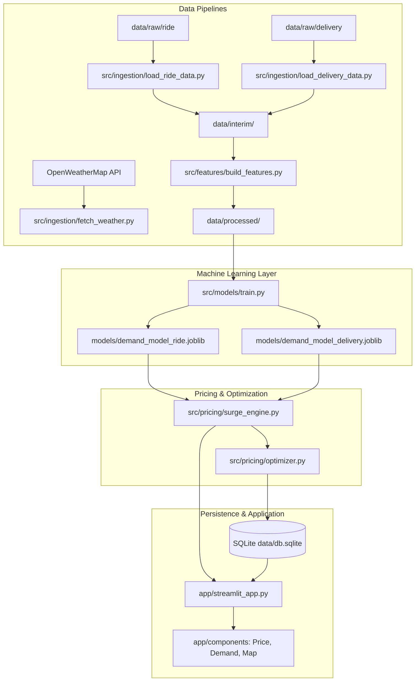

# Dynamic Fare Engine — System Architecture & Design Specification

## 1. System Overview

The **Dynamic Fare Engine** is a high-throughput, multi-modal dynamic pricing and revenue optimization platform designed for on-demand **Ride-Hailing (Uber/Lyft)** and **Food Delivery** marketplaces.

It integrates machine learning demand forecasting, logistic price elasticity models, and constrained revenue optimization algorithms to compute real-time surge multipliers.

---

## 2. Mathematical Formulations

### A. Dynamic Surge Multiplier
Given incoming ride demand $D_z(t)$ and active driver fleet supply $S_z(t)$ for urban zone $z$ at timestep $t$:

$$\text{Ratio}_z(t) = \frac{D_z(t)}{\max(1, S_z(t))}$$

$$\text{Surge}(D, S) = \begin{cases} 1.0 & \text{if } \text{Ratio}_z(t) \le 1.0 \\ \text{clip}\left(1.0 + \alpha \cdot (\text{Ratio}_z(t) - 1.0) \cdot \beta_z, \, 1.0, \, 3.5\right) & \text{if } \text{Ratio}_z(t) > 1.0 \end{cases}$$

Where:
- $\alpha = 0.85$ (Market elasticity sensitivity factor)
- $\beta_z$ = Zone-specific demand multiplier
- Clamped within $[\text{min\_surge}, \text{max\_surge}] = [1.0, 3.5]$.

### B. Multi-Modal Pricing Formulas

#### 1. Ride-Hailing Dynamic Fare
$$\text{BaseCost} = \left( C_{\text{base}} + (R_{\text{mile}} \cdot d) + (R_{\text{min}} \cdot t) \right) \cdot M_{\text{tier}}$$

$$\text{TotalFare}_{\text{ride}} = \text{BaseCost} \cdot \text{Surge}(D, S)$$

Where:
- $C_{\text{base}} = \$3.50$, $R_{\text{mile}} = \$1.85/\text{mile}$, $R_{\text{min}} = \$0.35/\text{min}$
- $M_{\text{tier}} \in \{1.0 \text{ (Standard)}, 1.60 \text{ (Premium)}, 0.80 \text{ (Shared)}\}$.

#### 2. On-Demand Food Delivery Dynamic Fee
$$\text{TotalDeliveryFee} = \left( F_{\text{base}} + \max(0, d - 2.0) \cdot R_{\text{km}} \right) \cdot \text{Surge} + S_{\text{basket}} + S_{\text{weather}} + S_{\text{traffic}}$$

Where:
- $F_{\text{base}} = 30.0\text{ INR}$, $R_{\text{km}} = 8.0\text{ INR/km}$
- $S_{\text{basket}} = 15.0\text{ INR}$ if Order Value $< 250\text{ INR}$, else $0.0$
- $S_{\text{weather}} = (\text{WeatherSeverity} - 1) \cdot 10.0$
- $S_{\text{traffic}} = (\text{TrafficSeverity} - 1) \cdot 5.0$.

### C. Expected Revenue Optimization
The `PriceOptimizer` solves for the optimal surge $s^*$:

$$s^* = \arg\max_{s \in [1.0, 3.5]} \Big( \text{Fare}(s) \cdot P_{\text{accept}}(s) \cdot P_{\text{fulfill}}(s) \Big)$$

---

## 3. Component Architecture

| Module | Location | Role |
|---|---|---|
| Ingestion | `src/ingestion/` | Parses Boston ride dataset, India food delivery logistics, and OpenWeatherMap APIs. |
| Feature Engineering | `src/features/` | Extracts cyclical time transforms ($\sin/\cos$), vehicle tier encodings, and rolling zone velocity. |
| Model Training | `src/models/` | XGBoost/Random Forest regression for demand forecasting and delivery delay prediction. |
| Pricing Engine | `src/pricing/` | Computes dynamic surge multipliers, itemized quotes, driver earnings, and platform margins. |
| Storage Layer | `src/db/` | SQLite database persistence for urban zones, pricing transaction logs, and snapshots. |
| Web Frontend | `app/` | Modern Streamlit dashboard with dark mode CSS, real-time ML inference, maps, and simulation. |
| Scheduler Blueprint | `scheduler/hourly_job.py` | Complete architectural blueprint documented in comments for periodic batch runs. |

---

## 4. Database Schema

- **`zones`**: Urban zone geographic catalog (Boston center coordinates and base demand multipliers).
- **`pricing_logs`**: Comprehensive transactional audit log of every pricing quote, customer decision, driver payout, and platform fee.
- **`marketplace_snapshots`**: Time-series log of active drivers, incoming requests, and calibrated surges per zone.
